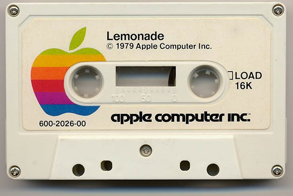

# Audio Cassette Backup
Audio Cassette Backup application allows you to easily create a high quality backup of your code, photos, or important documents on an audio cassette using tape recorder. 

## Contributors
- Dmitry Pavlov | also knows as the "[Coding Machine](http://coding-machine.net/)"
  - feel free to drop me a line at [me@dmitry-pavlov.com](mailto:me@dmitry-pavlov.com)

NOTE: The project is open for joining one day only - [April 1st, 2021](https://github.com/dmitry-pavlov/audio-cassette-backup/blob/master/src/AudioCassetteBackup/Program.cs). All requests after this date won't be accepted. Hurry up! (:  

## Support Development
If you like the project but have no time or skills to contribute as a software developer please consider supporting it by [buying a coffee](https://www.buymeacoffee.com/dmitrypavlov). We will convert #C0FFEE to #C0DE. Thank you for your support! 

## Features
- Create custom data, audio and mixed-mode projects and record them to physical audio cassettes as well as tapes images.
- Record images (ISO and BIN/CUE).
- Supports recording to four types of tape:
  - Type 0 - This is the original ferric-oxide tape. It is very rarely seen these days.
  - Type 1 - This is standard ferric-oxide tape, also referred to as "normal bias."
  - Type 2 - This is "chrome" or CrO2 tape. 
  - Type 4 - This is "metal" tape.
- Create cassette tapes copies, on the fly and using a temporary disc image.
- Blank (erase) rewritable cassette tapes using four different methods.
- Fixate cassettes (write lead-out information to prevent further data from being added to the cassette).
- Import session data from multi-session cassettes and add more sessions to them.
- Save audio and data tracks to files (.wav, .wma, .ogg, .mp3 and .iso).
- Cross-platform: Linux, iOS, Android, Windows, and many more operating systems supported! 

## Links
[Implementation of Audio Steganogarphy Using C#](https://www.academia.edu/25223280/Implementation_of_Audio_Steganogarphy_Using_C_)
// International Journal of Technology Management & Humanities (IJTMH), e-ISSN: 2454 – 566X, Volume 1, Issue 2, (September 2015)
- Vinay Yadav (Asst. Professor/Department of CSE/SR Group of Institutions, Lucknow)
- Sumeet Gupta (Asst. Professor /Department of CSE/SR Group of Institutions, Lucknow)
- Vijay Jaiswal (Research Scholar /Department of CSE/UPTU, Lucknow)

